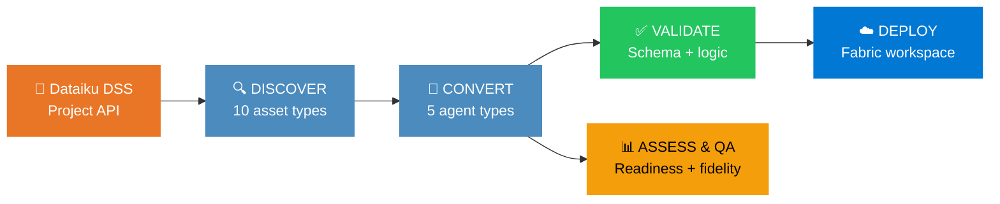
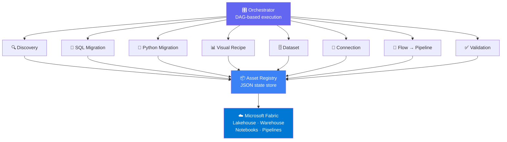

# 🔄 Dataiku → Microsoft Fabric

**Automated Migration Toolkit** — convert Dataiku projects (SQL recipes, Python recipes, flows, datasets, connections) to native Microsoft Fabric assets in minutes, fully automated, agent-driven.

| | |
|---|---|
| 🏷️ **Version** | 2.0.0 |
| ✅ **Tests** | 877 passed |
| 🐍 **Python** | 3.10+ |
| 📜 **License** | MIT |

| 🎯 **Capabilities** | 9 migration agents · 10 SQL Oracle rules · 9 PostgreSQL rules · 20+ SDK patterns · 10 visual recipe types · 12 connection types |

---

## ⚡ Quick Start

```bash
# One command — discover, convert, validate
dataiku-to-fabric migrate --project MY_PROJECT --target MY_FABRIC_WORKSPACE
```

> [!TIP]
> No live Dataiku server? Run the bundled demo: `py examples/run_demo.py`
> Exercises all 13 migration steps offline with sample fixtures.

<details>
<summary><b>📦 Installation</b></summary>

```bash
git clone https://github.com/cyphou/DataikuToFabric.git
cd DataikuToFabric && pip install -e ".[all]"

# Configure
cp config/config.template.yaml config/config.yaml
# Edit config.yaml with your Dataiku & Fabric credentials
```

**Requirements:** Python 3.10+ · Azure CLI (for Fabric auth) · Dataiku API v12+.

</details>

### More ways to migrate

#### 🔍 Discover assets

```bash
dataiku-to-fabric discover --project MY_PROJECT
dataiku-to-fabric discover --project MY_PROJECT --output-format json
```

#### 🔄 Full migration

```bash
# Full migration with all agents
dataiku-to-fabric migrate --project MY_PROJECT --target MY_WORKSPACE

# Specific agents only
dataiku-to-fabric migrate --project MY_PROJECT --target MY_WORKSPACE --agents sql python

# Resume from checkpoint
dataiku-to-fabric migrate --project MY_PROJECT --target MY_WORKSPACE --resume

# Re-run a failed agent
dataiku-to-fabric migrate --project MY_PROJECT --target MY_WORKSPACE --rerun sql_migration

# Dry run — preview execution plan
dataiku-to-fabric migrate --project MY_PROJECT --target MY_WORKSPACE --dry-run

# Filter to specific assets
dataiku-to-fabric migrate --project MY_PROJECT --target MY_WORKSPACE --asset-ids "recipe_compute_customer_360,dataset_CRM_CUSTOMERS"
```

#### ⚡ Quality & analysis

```bash
# Pre-migration readiness assessment
dataiku-to-fabric assess --project MY_PROJECT

# Full QA suite (governance, fidelity, cross-validation)
dataiku-to-fabric qa --project MY_PROJECT --auto-fix --compare

# Schema drift detection
dataiku-to-fabric check-drift --project MY_PROJECT --baseline snapshots/baseline.json

# Lineage map & impact analysis
dataiku-to-fabric lineage --project MY_PROJECT --impact dataset_CRM_CUSTOMERS

# Multi-project merge
dataiku-to-fabric merge --projects "PROJECT_A,PROJECT_B" --resolution newest
```

#### 🌐 REST API server

```bash
dataiku-to-fabric serve --host 0.0.0.0 --port 8080
```

#### 🧪 Validation & reporting

```bash
dataiku-to-fabric validate --project MY_PROJECT
dataiku-to-fabric report --project MY_PROJECT --output-format json
dataiku-to-fabric status --output-format table
```

---

## 🎯 Key Features

<table>
<tr>
<td width="50%">

### 📝 SQL Dialect Translation
Translates Oracle and PostgreSQL SQL to **T-SQL** or **Spark SQL** via sqlglot:
`NVL→ISNULL`, `DECODE→CASE`, `SYSDATE→GETDATE()`, `ROWNUM→ROW_NUMBER()`, `CONNECT BY→recursive CTE`, `LISTAGG→STRING_AGG`, `::cast→CAST()`, `ILIKE→LOWER() LIKE`, `LATERAL→CROSS APPLY`

</td>
<td width="50%">

### 🐍 Python SDK Migration
Rewrites **20+ Dataiku SDK patterns** to PySpark:
`dataiku.Dataset().get_dataframe()→spark.read.format("delta")`,
`write_dataframe()→df.write.format("delta")`,
`dataiku.Folder()→Files path`,
`import dataiku→PySpark imports`,
10 pandas→PySpark conversions

</td>
</tr>
<tr>
<td>

### 📊 10 Visual Recipe Types
Converts Dataiku visual recipes to SQL:
Join, Group By, Filter, Window, Sort, Distinct, Top N, Pivot, Prepare, VStack — each with full column mapping and condition translation

</td>
<td>

### 🔗 12 Connection Types
Maps Dataiku connections to Fabric equivalents:
Oracle/PostgreSQL → On-Premises Data Gateway,
S3/Azure Blob → OneLake Shortcut,
HDFS → OneLake File Copy,
Filesystem → Lakehouse Files

</td>
</tr>
<tr>
<td>

### 🔍 QA Suite & Self-Healing
Full quality pipeline: validation → auto-fix (20 healer patterns) → governance (PII detection, naming conventions) → fidelity scoring → comparison report. Self-healing fixes SQL dialect leaks, notebook SDK remnants, and schema type mismatches.

</td>
<td>

### 🔗 Lineage Map
Every migration produces a lineage graph tracking provenance: datasets → recipes → outputs. Upstream/downstream traversal, impact analysis, Mermaid diagram export, and interactive HTML report.

</td>
</tr>
<tr>
<td>

### 📈 Assessment & Strategy
Pre-migration readiness scoring (A–F grade) across 8 categories: SQL complexity, Python SDK usage, visual recipes, data volume, connections, dependencies, custom plugins, scenarios. Strategy advisor recommends batch size and parallelism.

</td>
<td>

### 🔄 Schema Drift Detection
Snapshot-based drift detection: baseline vs current comparison, severity classification (info/warning/breaking), added/removed/modified asset tracking, HTML drift report.

</td>
</tr>
<tr>
<td>

### 🧩 Plugin System
Extensible via plugins with 7 lifecycle hooks: `on_discovery`, `on_pre_convert`, `on_post_convert`, `on_pre_validate`, `on_post_validate`, `on_pre_deploy`, `on_post_deploy`. Drop `.py` files into the `plugins/` directory.

</td>
<td>

### 🔀 Multi-Project Merge
Merge multiple Dataiku projects into one Fabric workspace: fingerprint-based asset matching, conflict resolution (newest/oldest/manual), deduplication, and merge assessment scoring.

</td>
</tr>
</table>

---

## ⚙️ How It Works



**🔍 Step 1 — Discover:** Scans Dataiku project via API, catalogs 10 asset types (SQL/Python/Visual recipes, datasets, connections, flows, scenarios, models, dashboards, folders)

**🔄 Step 2 — Convert:** 5 specialized agents convert each asset to its Fabric equivalent (SQL → T-SQL, Python → Notebook, Visual → SQL, Datasets → DDL, Flows → Pipelines)

**✅ Step 3 — Validate:** Schema comparison, SQL syntax check, notebook structure, pipeline integrity, connection mapping, row count verification

**☁️ Step 4 — Deploy:** Upload converted assets to Fabric workspace via REST API

### 🏗️ Agent Architecture



Each agent runs in **parallel waves** (independent agents execute concurrently). The orchestrator handles retries, checkpointing, resume, and circuit-breaking.

---

## 🗺️ Migration Mapping

### Dataiku → Fabric Asset Map

| Dataiku Asset | Fabric Target | Agent |
|---------------|---------------|-------|
| SQL Recipe (Oracle) | T-SQL Script / Spark SQL | SQL Migration |
| SQL Recipe (PostgreSQL) | T-SQL Script / Spark SQL | SQL Migration |
| Python Recipe | Fabric Notebook (PySpark `.ipynb`) | Python Migration |
| Visual Recipe (Join/Group/Filter/Window/Pivot/Prepare/Sort/Distinct/TopN/VStack) | Generated SQL Query | Visual Recipe |
| Dataset (managed) | Lakehouse Table (Delta) | Dataset |
| Dataset (SQL table) | Warehouse Table | Dataset |
| Managed Folder | Lakehouse Files Section | Dataset |
| Flow Graph | Data Pipeline | Flow → Pipeline |
| Scenario (Schedule) | Pipeline Trigger | Flow → Pipeline |
| Connection (Oracle/PG) | On-Premises Data Gateway | Connection |
| Connection (S3/Azure) | OneLake Shortcut | Connection |
| Connection (HDFS) | OneLake File Copy | Connection |
| Connection (Filesystem) | Lakehouse Files | Connection |

### SQL Dialect Translation

| Source | Function | Target (T-SQL) |
|--------|----------|----------------|
| Oracle | `NVL(a, b)` | `ISNULL(a, b)` |
| Oracle | `NVL2(a, b, c)` | `CASE WHEN a IS NOT NULL THEN b ELSE c END` |
| Oracle | `SYSDATE` | `GETDATE()` |
| Oracle | `DECODE(x,a,b,c)` | `CASE x WHEN a THEN b ELSE c END` |
| Oracle | `ROWNUM` | `ROW_NUMBER() OVER (...)` |
| Oracle | `CONNECT BY` | Recursive CTE |
| Oracle | `LISTAGG(col, ',')` | `STRING_AGG(col, ',')` |
| Oracle | `TO_DATE / TO_CHAR` | `CAST / FORMAT` |
| Oracle | `RETURNING INTO` | `OUTPUT` clause |
| PostgreSQL | `x::type` | `CAST(x AS type)` |
| PostgreSQL | `ILIKE` | `LOWER(x) LIKE LOWER(y)` |
| PostgreSQL | `LATERAL` | `CROSS APPLY` |
| PostgreSQL | `a \|\| b` (concat) | `a + b` |
| PostgreSQL | `SERIAL` | `INT IDENTITY(1,1)` |
| PostgreSQL | `LIMIT / OFFSET` | `OFFSET ... FETCH NEXT` |
| PostgreSQL | `RETURNING` | `OUTPUT` clause |

### Dataiku SDK → PySpark

| Dataiku | PySpark Equivalent |
|---------|-------------------|
| `dataiku.Dataset("x").get_dataframe()` | `spark.read.format("delta").load("Tables/x")` |
| `dataiku.Dataset("x").write_dataframe(df)` | `df.write.format("delta").mode("overwrite").save("Tables/x")` |
| `dataiku.Folder("x").get_path()` | `"/lakehouse/default/Files/x"` |
| `dataiku.get_custom_variables()` | `spark.conf.get()` equivalents |
| `import dataiku` | PySpark imports |

---

## 📝 CLI Reference

| Flag | Description |
|------|-------------|
| **Commands** | |
| `discover` | Scan Dataiku project, catalog all assets |
| `migrate` | Run full migration pipeline |
| `validate` | Validate migrated assets |
| `report` | Generate migration report |
| `assess` | Pre-migration readiness assessment |
| `qa` | Full QA suite (governance, fidelity, cross-validation) |
| `check-drift` | Schema drift detection |
| `lineage` | Lineage graph & impact analysis |
| `serve` | Start REST API server |
| `merge` | Multi-project merge |
| `config validate` | Validate configuration file |
| `status` | Show migration status |
| `interactive` | Launch guided migration wizard |
| **Migrate Options** | |
| `--project`, `-p` | Dataiku project key (required) |
| `--target`, `-t` | Fabric workspace name or ID (required) |
| `--config`, `-c` | Config file path (default: `config/config.yaml`) |
| `--agents`, `-a` | Specific agents to run (default: all) |
| `--resume` | Resume from last checkpoint |
| `--rerun AGENT` | Force re-run specific agent (resets downstream) |
| `--asset-ids IDS` | Comma-separated asset IDs to process |
| `--keep-checkpoints` | Keep checkpoint files after completion |
| `--dry-run` | Print execution plan without running |
| `--output-format`, `-f` | Output format: `table`, `json`, `yaml` |
| `--quiet`, `-q` | Suppress progress bars |
| **QA Options** | |
| `--auto-fix` | Enable automatic issue resolution |
| `--compare` | Generate comparison report |
| **Drift Options** | |
| `--baseline FILE` | Path to baseline snapshot JSON |
| **Lineage Options** | |
| `--impact ASSET_ID` | Show impact analysis for specific asset |
| **Merge Options** | |
| `--projects KEYS` | Comma-separated project keys |
| `--resolution MODE` | Conflict resolution: `newest`, `oldest`, `manual` |
| **Server Options** | |
| `--host` | Bind address (default: `127.0.0.1`) |
| `--port` | Port number (default: `8080`) |

---

## 📂 Generated Output

<details>
<summary><b>📁 Full output structure</b> (click to expand)</summary>

```
output/
├── sql/                                   ← Converted SQL scripts
│   ├── compute_customer_360.sql           ← Oracle → T-SQL
│   ├── compute_product_metrics.sql        ← PostgreSQL → T-SQL
│   ├── join_customer_orders_visual.sql    ← Visual recipe → SQL
│   └── ...
├── notebooks/                             ← Generated Fabric Notebooks
│   └── build_customer_features.ipynb      ← Python → PySpark
├── ddl/                                   ← Table definitions
│   ├── CRM_CUSTOMERS.sql                  ← Warehouse T-SQL
│   ├── WEB_SESSIONS.sql                   ← Lakehouse Delta (partitioned)
│   └── ...
├── pipelines/                             ← Fabric Data Pipeline JSON
│   ├── CUSTOMER_ANALYTICS_pipeline.json   ← Main pipeline
│   ├── daily_customer_refresh_trigger.json
│   └── ...
├── connections/                           ← Mapped connection configs
│   ├── oracle_erp_prod.json              ← → OnPremises Gateway
│   ├── s3_datalake.json                  ← → OneLake Shortcut
│   └── ...
├── reports/                               ← Migration reports
│   ├── validation_report.json
│   ├── assessment.html                    ← Readiness grade (A–F)
│   ├── qa_report.html                     ← QA findings
│   ├── lineage.html                       ← Interactive lineage graph
│   ├── drift_report.html                  ← Schema drift
│   └── merge_report.html                  ← Multi-project merge
├── lineage.mmd                            ← Mermaid lineage diagram
└── registry.json                          ← Asset registry state
```

</details>

---

## 🤖 Agent Catalog

| # | Agent | Responsibility | Input | Output |
|---|-------|----------------|-------|--------|
| 1 | 🎛️ **Orchestrator** | DAG-based coordination, retries, checkpointing | Config | Migration report |
| 2 | 🔍 **Discovery** | Scan Dataiku via API, catalog 10 asset types | Project key | Registry JSON |
| 3 | 📝 **SQL Migration** | Oracle/PG → T-SQL / Spark SQL via sqlglot | SQL recipes | `.sql` scripts |
| 4 | 🐍 **Python Migration** | Dataiku SDK → PySpark, generate notebooks | Python recipes | `.ipynb` files |
| 5 | 📊 **Visual Recipe** | Join/Group/Filter/Window/Pivot/Prepare → SQL | Visual recipes | `.sql` queries |
| 6 | 🗄️ **Dataset** | Schema mapping, DDL, Lakehouse/Warehouse | Dataset metadata | DDL scripts + data |
| 7 | 🔄 **Flow → Pipeline** | DAG → Fabric Data Pipeline, scenarios → triggers | Flow JSON | Pipeline JSON |
| 8 | 🔗 **Connection** | Map 12 connection types to Fabric equivalents | Connection config | Fabric configs |
| 9 | ✅ **Validation** | Schema match, SQL syntax, notebook structure | Migrated assets | Validation report |

> 📖 Full specifications → [docs/AGENTS.md](docs/AGENTS.md)

---

## 🧪 Testing

```bash
py -m pytest tests/ -v                       # Run all 877 tests
py -m pytest tests/test_sql_translator.py    # Run specific file
py -m pytest tests/ --cov --cov-report=html  # Coverage report
```

<details>
<summary><b>📋 Test suite breakdown</b> (click to expand)</summary>

| Test Area | Tests | Coverage |
|-----------|-------|----------|
| Validation agent | 85 | Schema, SQL, notebook, pipeline, connection validation |
| Flow pipeline agent | 65 | DAG builder, topological sort, triggers, activities |
| Dataset agent | 55 | Type mapping, DDL, partitioning, schema comparison |
| CLI | 53 | All commands, flags, output formats, interactive |
| Visual recipe agent | 40 | 10 recipe types, column mapping, conditions |
| Connection agent | 39 | 12 connection types, gateway/shortcut templates |
| Oracle SQL rules | 33 | DECODE, NVL, NVL2, SYSDATE, ROWNUM, CONNECT BY |
| Checkpoint / resume | 33 | Checkpointing, resume, selective re-run |
| Python migration agent | 32 | SDK detection, conversion, notebook generation |
| PostgreSQL SQL rules | 31 | Cast, ILIKE, LATERAL, concat, SERIAL, LIMIT |
| Data migration | 29 | Export, upload, Delta load, incremental |
| Self-healing | 28 | SQL (9), notebook (5), pipeline (3), schema (3) healers |
| SQL migration agent | 24 | Dialect detection, multi-statement, errors |
| Equivalence / regression | 21 | Schema match, type compat, regression baselines |
| API server | 19 | REST endpoints, job manager, health check |
| E2E pipeline | 19 | Full integration tests |
| Discovery agent | 19 | All 10 asset types, dependency resolution |
| QA suite | 18 | Governance, fidelity, cross-validation |
| Plugins | 18 | Plugin lifecycle, directory loading, hooks |
| Lineage | 18 | Graph building, traversal, impact analysis |
| Assessment | 16 | 8 categories, grading, strategy advisor |
| Schema drift | 14 | Snapshots, drift detection, severity |
| Merge | 14 | Config, assessment, deduplication, conflicts |
| + more | — | Translators, clients, logger, perf, conftest |

</details>

---

## 📁 Examples

The [`examples/`](examples/) directory contains a **complete migration walkthrough** for a sample **CUSTOMER_ANALYTICS** Dataiku project.

| Folder | Contents |
|--------|----------|
| [`examples/input/`](examples/input/) | 9 recipes, 5 datasets, 6 connections, 3 scenarios, 1 flow |
| [`examples/output/`](examples/output/) | 25 pre-generated Fabric assets (SQL, notebooks, DDL, pipelines, connections, reports) |
| [`examples/run_demo.py`](examples/run_demo.py) | Offline end-to-end demo — 13 steps, no servers needed |

```bash
# Run the full offline demo
py examples/run_demo.py

# Run specific steps
py examples/run_demo.py --step assess     # Assessment only
py examples/run_demo.py --step sql        # SQL translation
py examples/run_demo.py --step lineage    # Lineage graph
py examples/run_demo.py --step qa         # QA suite
```

> 📖 Full walkthrough → [examples/README.md](examples/README.md)

---

## 🏗️ Architecture

<details>
<summary><b>📁 Project structure</b> (click to expand)</summary>

```
DataikuToFabric/
├── README.md                              # This file
├── CHANGELOG.md                           # Version history
├── requirements.txt                       # Python dependencies
├── pyproject.toml                         # Packaging config
├── Dockerfile                             # Container build
│
├── config/
│   └── config.template.yaml               # Configuration template
│
├── src/
│   ├── cli.py                             # CLI entry point (13 commands)
│   ├── core/
│   │   ├── orchestrator.py                # DAG-based orchestrator
│   │   ├── registry.py                    # Asset registry (JSON state)
│   │   ├── config.py                      # Pydantic YAML config loader
│   │   └── logger.py                      # Structured logging (structlog)
│   ├── agents/
│   │   ├── base_agent.py                  # Abstract agent (execute/validate/rollback)
│   │   ├── discovery_agent.py             # 🔍 Dataiku API scanner
│   │   ├── sql_migration_agent.py         # 📝 SQL dialect translation
│   │   ├── python_migration_agent.py      # 🐍 Python → Notebook
│   │   ├── visual_recipe_agent.py         # 📊 Visual → SQL (10 types)
│   │   ├── dataset_agent.py               # 🗄️ Schema + DDL
│   │   ├── flow_pipeline_agent.py         # 🔄 Flow → Pipeline
│   │   ├── connection_agent.py            # 🔗 Connection mapping
│   │   └── validation_agent.py            # ✅ Validation
│   ├── connectors/
│   │   ├── dataiku_client.py              # Dataiku REST API client
│   │   └── fabric_client.py               # Fabric REST API + OneLake
│   ├── translators/
│   │   ├── sql_translator.py              # sqlglot-based SQL translation
│   │   ├── oracle_to_tsql.py              # Oracle → T-SQL (10 rules)
│   │   ├── postgres_to_tsql.py            # PostgreSQL → T-SQL (9 rules)
│   │   └── python_to_notebook.py          # Python → .ipynb (20+ patterns)
│   ├── analyzers/
│   │   ├── project_analyzer.py            # Readiness assessment (8 categories)
│   │   └── strategy_advisor.py            # Migration strategy recommendation
│   ├── qa/
│   │   ├── qa_suite.py                    # Full QA pipeline
│   │   ├── governance.py                  # PII detection, naming conventions
│   │   ├── cross_validator.py             # Cross-asset validation
│   │   ├── fidelity.py                    # Migration fidelity scoring
│   │   └── comparison_report.py           # QA HTML report
│   ├── healers/
│   │   ├── base_healer.py                 # Healer registry + ABC
│   │   ├── sql_healers.py                 # 9 SQL auto-fix patterns
│   │   ├── notebook_healers.py            # 5 notebook auto-fix patterns
│   │   ├── pipeline_healers.py            # 3 pipeline auto-fix patterns
│   │   └── schema_healers.py              # 3 schema auto-fix patterns
│   ├── drift/
│   │   ├── snapshot.py                    # Migration snapshots
│   │   └── drift_detector.py              # Drift detection + severity
│   ├── lineage/
│   │   ├── lineage_model.py               # Graph model (nodes, edges, traversal)
│   │   └── lineage_builder.py             # Build lineage from registry
│   ├── merge/
│   │   ├── merge_config.py                # Multi-project merge config
│   │   ├── merge_assessment.py            # Merge feasibility scoring
│   │   └── deduplicator.py                # Asset deduplication
│   ├── api/
│   │   ├── server.py                      # REST API (health, assets, jobs)
│   │   └── job_manager.py                 # Async job tracking
│   ├── plugins/
│   │   ├── base_plugin.py                 # Plugin ABC (7 hooks)
│   │   └── plugin_manager.py              # Plugin discovery + loading
│   ├── testing/
│   │   ├── equivalence_tester.py          # Schema equivalence checks
│   │   └── regression_suite.py            # Regression snapshot testing
│   ├── reports/
│   │   ├── assessment_report.py           # Assessment HTML
│   │   ├── drift_report.py                # Drift HTML
│   │   ├── lineage_report.py              # Lineage HTML
│   │   └── merge_report.py                # Merge HTML
│   └── models/
│       ├── asset.py                       # Asset, AssetType, MigrationState
│       ├── migration_state.py             # State machine
│       └── report.py                      # Report model
│
├── tests/                                 # 877 tests
├── plugins/                               # User plugins directory
├── templates/                             # Notebook, pipeline, DDL templates
├── examples/                              # Sample migration project + demo
├── docs/                                  # Architecture, agents, dev plan
└── .github/                               # CI + 9 agent definitions
```

</details>

---

## 📊 Status

| Phase | Status | Description |
|-------|--------|-------------|
| 1–2 | ✅ Done | Core infrastructure, CLI, config, registry, logging |
| 3–4 | ✅ Done | Discovery, Dataiku + Fabric API clients |
| 5–6 | ✅ Done | SQL translation (Oracle + PG → T-SQL), Python → Notebook |
| 7–8 | ✅ Done | Visual recipes (10 types), Dataset DDL, Connection mapping |
| 9–10 | ✅ Done | Flow → Pipeline, Validation agent, reports |
| 11–12 | ✅ Done | DAG orchestrator, checkpoint/resume, selective re-run |
| 13–14 | ✅ Done | CLI hardening, --dry-run, Rich progress, interactive wizard |
| 15–16 | ✅ Done | Data migration, chunked upload, incremental watermark |
| 17–18 | ✅ Done | Integration tests, perf tests, Docker, CI |
| 19–20 | ✅ Done | Pre-migration assessment, strategy advisor |
| 21–22 | ✅ Done | QA suite (governance, fidelity, cross-validation) |
| 23 | ✅ Done | Self-healing engine (20 healer patterns) |
| 24 | ✅ Done | Schema drift detection |
| 25 | ✅ Done | Lineage graph, impact analysis, Mermaid export |
| 26 | ✅ Done | REST API server, async job management |
| 27 | ✅ Done | Plugin system, equivalence testing, multi-project merge |

---

## 📚 Documentation

| Document | Description |
|----------|-------------|
| 📖 [Setup Guide](docs/SETUP.md) | Installation, configuration & first run |
| 🤖 [Agent Specs](docs/AGENTS.md) | Full agent specifications |
| 🏗️ [Architecture](docs/ARCHITECTURE.md) | Core system design |
| 📋 [Dev Plan](docs/DEVPLAN.md) | Development roadmap (Phases 1–27) |
| 🔄 [Upgrade Plan](docs/UPGRADE_PLAN.md) | v2.0 expansion plan (Phases 19–30) |
| ⚠️ [Troubleshooting](docs/TROUBLESHOOTING.md) | Common errors & fixes |
| 📝 [Changelog](CHANGELOG.md) | Version history |
| 📦 [Examples](examples/README.md) | Migration walkthrough & offline demo |

---

> 📖 **Next:** [docs/SETUP.md](docs/SETUP.md) to get started · [examples/run_demo.py](examples/run_demo.py) to try it offline · [docs/AGENTS.md](docs/AGENTS.md) for agent specs
